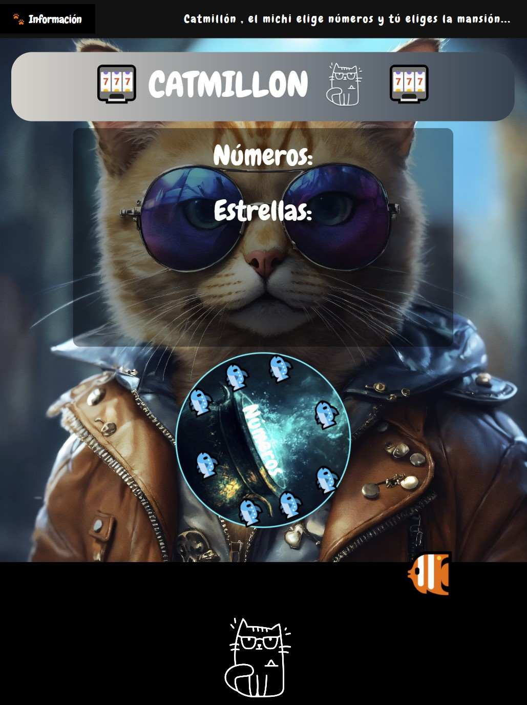
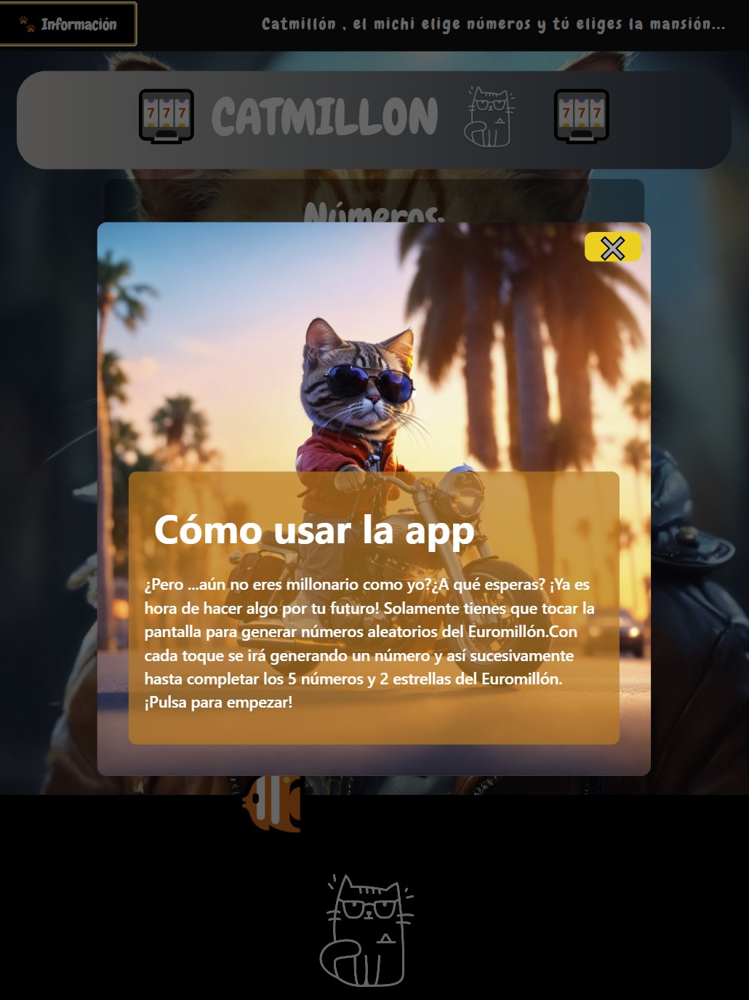
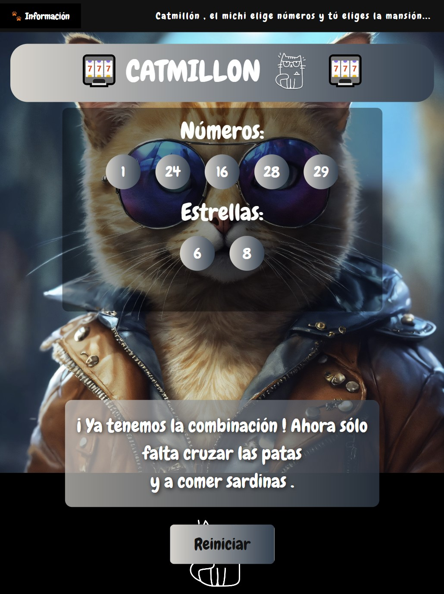

# Catmillón

Catmillón es una aplicación interactiva desarrollada con React y Vite, pensada para que los gatos (¡y humanos!) puedan jugar eligiendo combinaciones de números y estrellas al estilo de la lotería europea. La app está preparada para usarse en tablets para que pueda ocurrir la interacción táctil y ofrecer así una experiencia divertida y visualmente atractiva.

## Características principales

- **Interfaz adaptada a tablets**: Solo se muestra correctamente en dispositivos con pantalla tipo tablet.
- **Ruleta de números y estrellas**: El usuario (o el gato) puede ir generando números y estrellas aleatorios, sin repeticiones.
- **Animaciones y sonidos**: Cada acción reproduce sonidos y muestra animaciones para hacer la experiencia más entretenida.
- **Modal de información**: Acceso rápido a las instrucciones y detalles del juego desde el botón de información en el navbar.
- **Botón de reinicio**: Permite volver a empezar la partida en cualquier momento con el botón "reiniciar".
- **Diseño visual atractivo**: Inspirado en el mundo felino y la suerte.

## ¿Cómo funciona?

1. Pulsa en la pantalla para que el "michi" elija los números y las estrellas.
2. Cuando completes la combinación (5 números y 2 estrellas), ¡recibirás un mensaje de enhorabuena!
3. Puedes reiniciar la partida y volver a jugar tantas veces como quieras.

## Instalación y uso

1. Clona el repositorio.
2. Instala las dependencias con `npm install`.
3. Inicia la app con `npm run dev`.
4. Abre la aplicación en una tablet o ajusta el tamaño de la ventana para simular una tablet.

## Proyecto futuro

Me gustaría ampliar esta app añadiendo una base de datos donde se registren las últimas combinaciones generadas. Así, los usuarios podrían consultar el historial de partidas y ver las combinaciones anteriores, haciendo la experiencia más completa y divertida.

## Mejoras opcionales implementadas

- Animaciones y sonidos para una experiencia más divertida.
- Modal de información accesible desde el navbar.
- App responsive: funciona en tablets, móviles y escritorio.
- Botón de reinicio para volver a jugar fácilmente.

## URL de la aplicación

Puedes probar la app online aquí:  
[https://mi-proyecto-bay.vercel.app/](https://mi-proyecto-bay.vercel.app/)

## Capturas de pantalla

  
  
    

---

¡Diviértete jugando con Catmillón !
